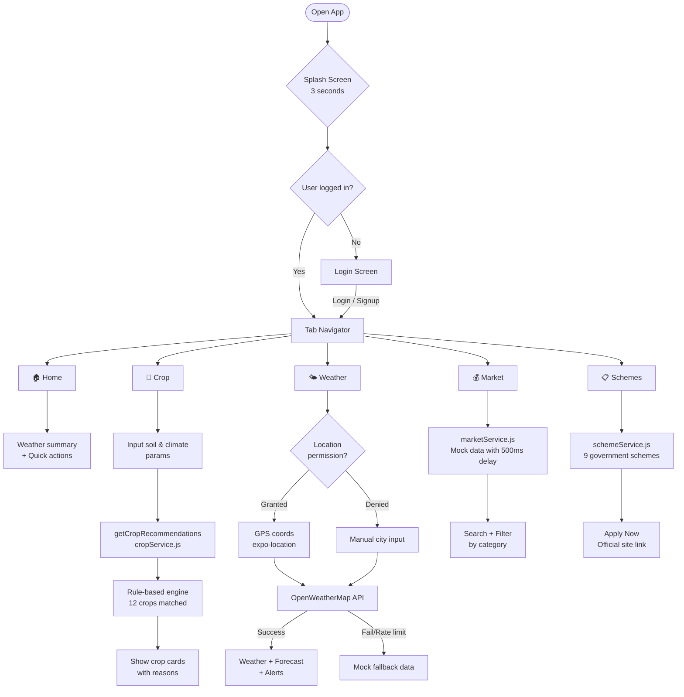
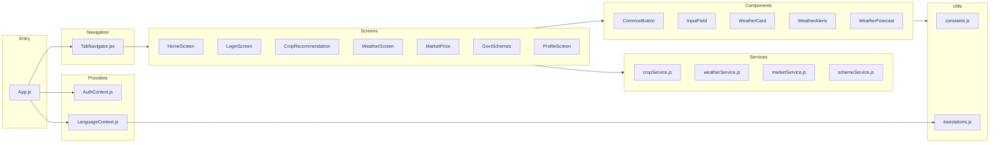
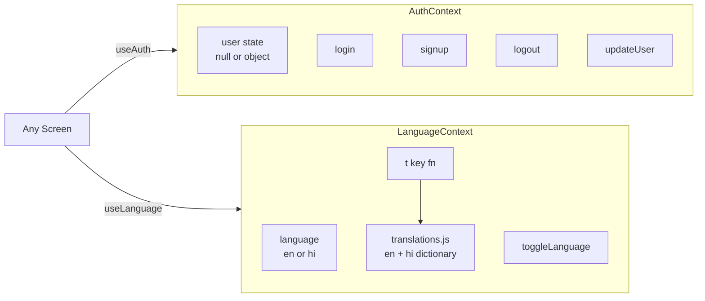
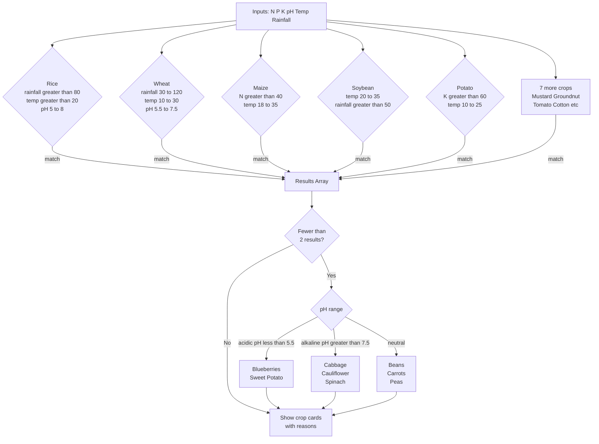
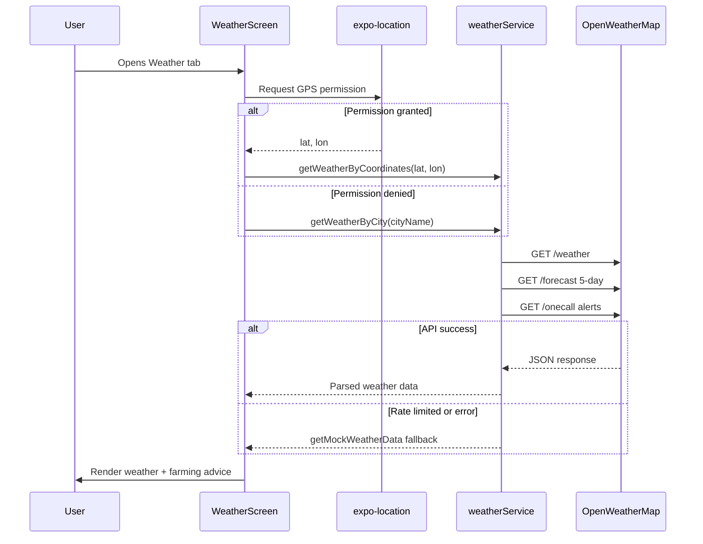

# KrishiGuide 🌾
### A farming companion app built with React Native + Expo
 
> Built as my MAD (Mobile Application Development) end-semester project — but honestly, I wanted to make something that actually solves a real problem for farmers who don't have easy access to agronomic advice, weather data, or government scheme information in one place.
 
**[▶ Watch Demo Video](https://drive.google.com/file/d/1_YktUFf91kjLU2BodZJYp2_nq5OoahC4/view?usp=sharing)** · [GitHub Repo](https://github.com/MOHITKOURAV01/Krishi_Guide)
 
---
 
## What is this?
 
KrishiGuide is a bilingual (English + हिंदी) mobile app for farmers. You enter your soil's NPK values, pH, temperature, and rainfall — and it tells you which crops will actually grow well. It also pulls real-time weather, shows mandi prices, and lists government schemes with direct application links.
 
The whole thing runs on React Native + Expo, so it works on Android and iOS from a single codebase. No backend — everything is either a live API call or smart local logic.
 
---
 
## App Flow
 

 
---
 
## Architecture
 
The folder structure follows a strict separation of concerns — screens are kept thin, all business logic lives in services.
 

 
---
 
## State Management
 
Two React Context providers handle all global state. No Redux — kept it simple on purpose.
 

 
---
 
## Crop Recommendation Logic
 
The engine in `cropService.js` is rule-based — it checks your soil and climate data against known agronomic ranges for 12 crops, then falls back to pH-based suggestions if fewer than 2 crops match.
 

 
---
 
## Weather Service Flow
 

 
---
 
## Screens at a Glance
 
| Screen | Key Feature | Data Source |
|--------|-------------|-------------|
| Login | Email/password auth, name extracted from email | AuthContext (mock) |
| Home | Location weather summary, quick nav cards | weatherService + AuthContext |
| Crop Recommendation | NPK + climate inputs → crop suggestions | cropService.js (rule engine) |
| Weather | GPS weather, 5-day forecast, farming tips | OpenWeatherMap API |
| Market Prices | Search + category filter, price trend arrows | marketService.js (mock) |
| Govt Schemes | 9 schemes, benefits, Apply Now links | schemeService.js (static) |
| Profile | Edit profile, photo upload, language toggle | AuthContext + expo-image-picker |
 
---
 
## Tech Stack
 
| Layer | Technology |
|-------|-----------|
| Framework | React Native 0.81 + Expo SDK 54 |
| Language | JavaScript (JSX) |
| Navigation | React Navigation — Bottom Tabs |
| State | React Context API |
| Location | expo-location |
| Images | expo-image-picker |
| Gradients | expo-linear-gradient |
| Icons | Expo Vector Icons (Ionicons) |
| Weather API | OpenWeatherMap (free tier) |
 
---
 
## Getting Started
 
```bash
# 1. Clone
git clone https://github.com/MOHITKOURAV01/Krishi_Guide.git
cd Krishi_Guide
 
# 2. Install deps
npm install
 
# 3. Install Expo packages
npx expo install expo-location expo-image-picker expo-linear-gradient
 
# 4. Start dev server
npx expo start
```
 
Scan the QR code with **Expo Go** on your phone. Press `a` for Android emulator or `i` for iOS simulator.
 
> **API Key**: Add your OpenWeatherMap key in `app/services/weatherService.js` under `API_KEYS.OPENWEATHER`. Free tier works fine for development.
 
---
 
## Honest Limitations
 
This is a student project, so some things are deliberately simplified:
 
- **Auth is mocked** — `setTimeout` simulates a real API. No JWT, no backend. Production version would use Node.js + bcrypt + expo-secure-store.
- **Market prices are static** — hardcoded mock data. Real version would hit the Agmarknet / eNAM government API.
- **Crop engine is rule-based** — works well for known ranges, but a Random Forest trained on the Kaggle Crop Recommendation dataset would be more accurate.
- **No offline support** — AsyncStorage caching is on the roadmap.
- **API key is in source** — production would use a Node.js proxy so the key never ships in the client bundle.
 
---
 
## What I'd Build Next
 
- [ ] Real backend (Node.js + Express + MongoDB)
- [ ] ML crop prediction via Flask API + scikit-learn Random Forest
- [ ] Live mandi prices from Agmarknet / eNAM API
- [ ] Push notifications for weather alerts and scheme deadlines
- [ ] Offline mode with AsyncStorage caching
- [ ] More languages — Marathi, Punjabi, Telugu
- [ ] Crop disease detection via camera (React Native Vision Camera)
- [ ] Fertilizer and irrigation calculators
 
---
 
## Academic Context
 
Built for the **Mobile Application Development (MAD)** end-semester project at Newton School of Technology, ADYPU, Pune.
 
Demonstrates: React Native component architecture · Context API · Tab navigation · Live API integration with graceful fallback · GPS location services · Bilingual i18n system · Form handling and validation · expo-image-picker
 
---
 
**Mohit Kourav** · [@MOHITKOURAV01](https://github.com/MOHITKOURAV01)
 
*Made for farmers. Built to learn.*
 
